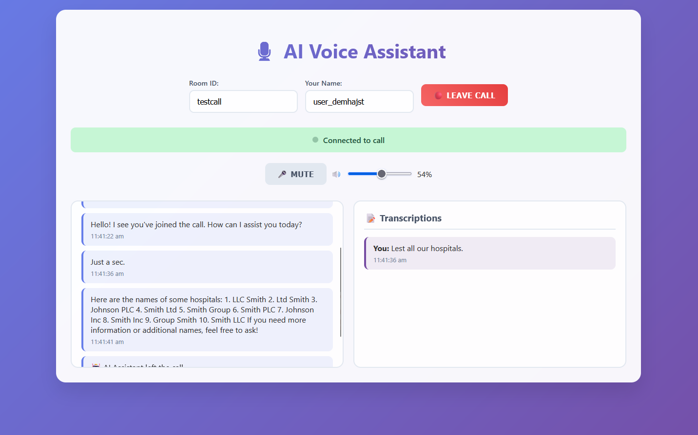

# 🧠 Neo4j-Powered Knowledge Graph with LlamaIndex RAG, LangGraph Agents & Real-Time Voice Bot

A scalable, intelligent LLM-based system combining **Neo4j**, **LlamaIndex**, **LangGraph**, and a **FastAPI voice bot** for real-time knowledge retrieval and conversation from voice input.

---

## Preview



## ✅ Project Summary

- ✅ Created **Knowledge Graph** in Neo4j to represent domain knowledge.
- ✅ Developed a **RAG agent** to query the KG using natural language via LlamaIndex.
- ✅ Implemented **WebSocket-based call system**, where the **bot joins an audio channel upon trigger** (not directly called).
- ✅ Built a **real-time audio interface** using browser and FastAPI.
- ✅ Added **speech-to-text transcription** using Whisper.
- ✅ Integrated **silence detection and noise filtering** to prevent unnecessary responses.
- ✅ Bot **decodes user speech**, queries the graph, and **responds intelligently using LLMs.**
- ✅ The system **splits incoming audio into chunks from silence to silence** using an audio processor.
- ✅ The **Socket Manager efficiently handles real-time audio transmission**, breaking audio into **silence-based segments** for processing.

## 📂 Key Components

### `audio_processor.py`
- Detects **silence in audio** and uses it as a natural breakpoint to split each user question.
- Ensures the system only processes **complete audio segments from one silence point to the next**.

### `transcriber.py`
- Handles **real-time transcription** of the segmented audio chunks.
- Uses **Whisper** for accurate speech-to-text conversion.

### `socket_manager.py`
- Manages the **WebSocket connection** for real-time audio streaming.
- Uses the `on_receive` function to **capture and split audio streams into silence-based segments.**
- Sends only **complete audio chunks (silence to silence)** to the processing pipeline.
- Supports **auto-disconnect** when the user leaves the call.


---

## 🧱 Tech Stack

| Component         | Role                                                  |
|-------------------|-------------------------------------------------------|
| **Neo4j**         | Structured graph database                             |
| **LlamaIndex**    | Graph-aware RAG (retrieval-augmented generation)      |
| **LangGraph**     | Multi-agent orchestration and reasoning logic         |
| **OpenAI / Azure**| Backend LLMs like GPT-4 / GPT-4o / GPT-4-turbo        |
| **FastAPI**       | WebSocket server, API endpoints                       |
| **Whisper**       | Real-time transcription of user audio                 |
| **HTML + JS**     | Frontend with audio streaming support                 |

---

## 🗂️ Project Structure

```bash
.
├── api/                          # API-related logic
├── audio/                        # Audio helpers or processing
│   └── audio_processor.py
├── config/                       # Configuration files
├── data/                         # Datasets (e.g., healthcare_dataset.csv)
├── examples/                     # Example files or notebooks
├── rag/                          # RAG logic and agents
│   └── neo4j.py
├── recordings/                   # Saved audio recordings
├── requirements/                 # Requirements files or setup configs
├── sockets/                      # WebSocket handling
│   └── socket_manager.py
├── static/                       # Static files (HTML, CSS, JS)
├── text_to_audio/                # Text-to-speech logic
│   └── edge_tts.py
├── transcription/                # Audio transcription logic
│   └── transcriber.py
├── utils/                        # Utility scripts
│   └── logger.py
├── .env-example                  # Example environment configuration
├── .gitignore
├── bot.py                        # Bot logic (join, listen, respond)
├── main.py                       # FastAPI app entry point
├── upload_data.py                # Load CSV data to Neo4j


```

## Run

This guide contains all the required steps to run the full voice-interactive system powered by Neo4j, LlamaIndex, LangGraph, and Whisper.

---

## 🛠️ Steps to Run

### 1. Create `.env` File

Create a `.env` file in the bot root with the details in .env-example

### 1.1. Move data to neo4j
```bash
cd bot
python upload_data.py
```
### 2. Run socket server
```bash
cd server
go run main.go
```
### 3. Run bot
```bash
cd bot
uvicorn bot:app --reload --host 0.0.0.0 --port 9000
```


### 4. Run user server
```bash
cd bot
uvicorn main:app --reload --host 0.0.0.0 --port 7000
```


